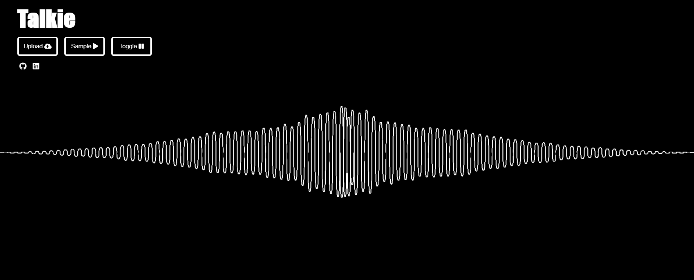

# Talkie
[Live Demo](https://chrisjterry.github.io/Talkie/)

Developed using Vanilla JavaScript, Canvas and Web Audio API, Talkie features an easy-to-use interface that allows users to visualize soundbites. Hit the "Sample" button or upload your own file to see Talkie in action.

